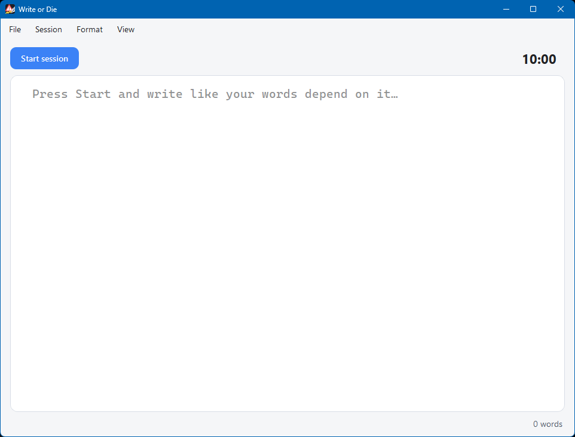
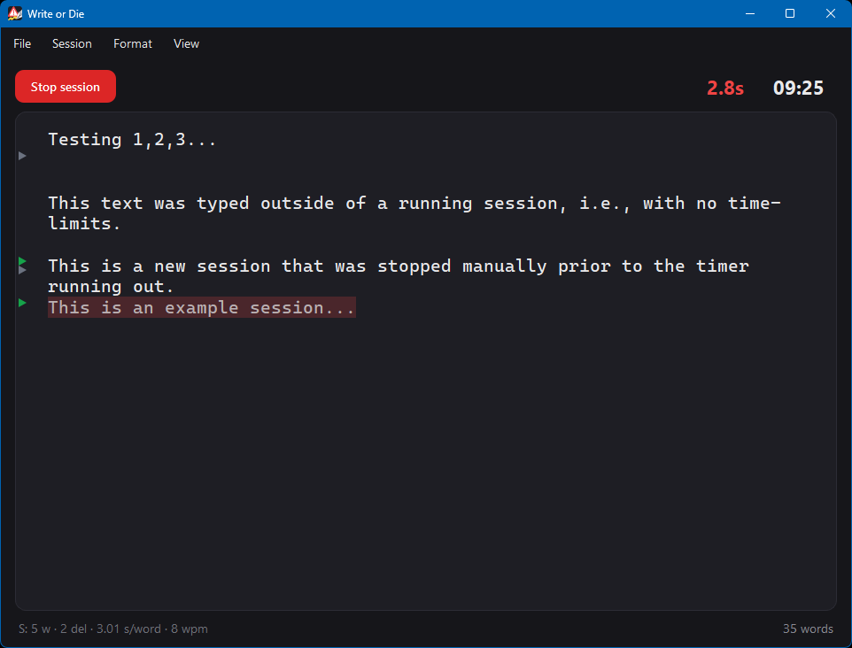
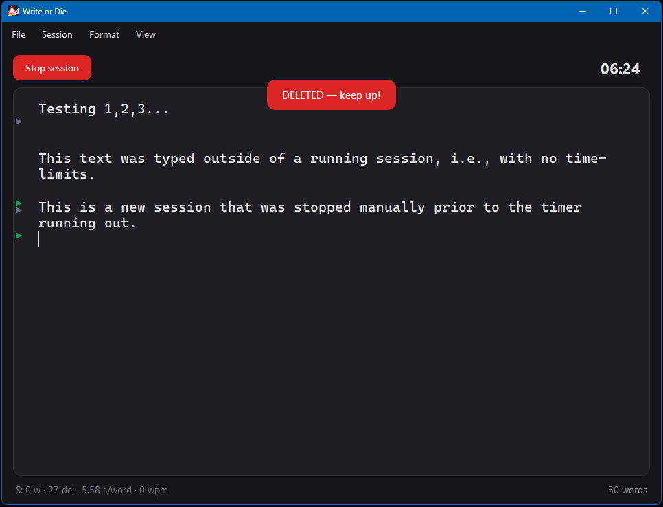

# Write or Die

> [!WARNING]
> **This project is 100% vibe coded.** There should be no expectation of
> stability, correctness, safety, maintenance, or fitness for any purpose.
> This software can intentionally delete text during use. Use it entirely at
> your own risk.

Write or Die is a Markdown editor with a dangerous-writing mode. Start a timed
session and keep typing. If you stop, the text blurs; stay idle too long and the
current session text is deleted. Survive until the timer ends and your text is
copied to the clipboard.

## Screenshots

| Light editor | Mid-session warning | Deleted session |
|--------------|---------------------|-----------------|
|  |  |  |

## Run

```bash
pip install -r requirements.txt
python main.py
```

## Build desktop apps

Install the build requirements first:

```bash
pip install -r requirements-build.txt
```

PyInstaller does not cross-compile. Run the build on the OS you want to target:

```bash
# Windows: dist/WriteOrDie.exe
python build_app.py --target windows

# macOS: dist/WriteOrDie.app
python build_app.py --target macos

# Debian-based Linux: dist/WriteOrDie plus write-or-die_0.1.1_amd64.deb
python build_app.py --target linux
```

`python build_exe.py` remains as a Windows-only shortcut.

## How it works

1. Pick a **Mode** from the Session menu and press **Start session**.
2. Keep writing. When you pause, the text starts to **blur**.
3. A red **deletion countdown** shows how long until the wipe. Only text written
   in the current session is faded/highlighted as at-risk. Type to reset it.
4. Stay idle past the threshold and the editor is **cleared**.
5. Survive until the session timer hits `00:00` and your text is **copied to the
   clipboard** with a popup confirmation.

## Modes

| Mode     | Idle to blur | Idle to delete | Session |
|----------|--------------|----------------|---------|
| Gentle   | 5 s          | 10 s           | 5 min   |
| Standard | 3 s          | 7 s            | 10 min  |
| Hardcore | 2 s          | 5 s            | 15 min  |
| Custom   | configurable | configurable   | configurable |

Only the text written **since the current session started** is at risk. Text
from earlier sessions is protected and never wiped.

## Session history

Use **Session > History...** to view the persistent master session log. Sessions
are grouped by date and time, color-coded by outcome/deletions, and include mode,
word count, deletions, WPM, average seconds per word, and duration.

Use **Session > Disable Stop during session** to prevent stopping a running
session manually. This is enabled automatically when Hardcore mode is selected.

## View menu

- **Hide all text** - blind-writing mode. You type without seeing the text. The
  text reappears and is copied when the session ends.
- **Focus mode** - hides everything except the text around the cursor. Use the
  in-menu +/- counters to set how many words and/or sentences to reveal.
- **Hemingway mode** - disables backspace, delete, and cursor movement. You can
  only write forward.
- **Typewriter mode** - keeps the current line vertically centered while text
  flows upward as you type.
- **Show timer** - the session countdown.
- **Show deletion countdown** - the red idle-to-deletion counter.
- **Show session marks** - ephemeral dashed lines marking where each session
  started/ended. These are drawn only and are never written into the `.md` file.
- **Dark mode** - toggles between dark and light color themes.

## Format menu

- **Font** - choose any installed font family from the menu dropdown.
- **Font size** - +/- counter from 6 to 48 pt.

All View/Format settings and Custom timing values persist between sessions.

## Interface details

- **Auto-hiding scrollbar** - the editor scrollbar is thin and minimal, fading in
  while you scroll or move the mouse and fading out after about a second idle.
- **Focus reveal animation** - in Focus mode, newly revealed text fades in and a
  finished sentence fades out instead of snapping.
- **Session stats** - the status bar shows live per-session stats on the left
  with the total document word count on the right. When no session is running it
  shows the last session summary.

## Files

- `main.py` - the entire application (PySide6 / Qt6).
- `build_app.py` - platform-specific PyInstaller packaging.
- `requirements.txt` - runtime dependency.
- `requirements-build.txt` - packaging dependencies.

## License and liability

Released under the MIT License. The license includes a broad "as is" warranty
disclaimer and limitation of liability. In plain terms: you are responsible for
your own use, misuse, data loss, and outcomes. See [LICENSE](LICENSE).
